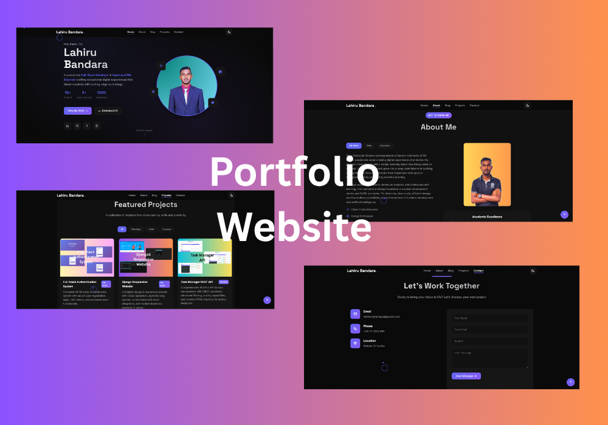

# Lahiru Bandara - Portfolio Website

A modern, responsive portfolio website showcasing my skills as a Full-Stack Developer and AI/ML enthusiast. Built with vanilla HTML, CSS, and JavaScript, featuring dark/light mode, smooth animations, and optimized performance.



## 🌟 Features

- **🌑 Dark/Light Mode** - Toggle between themes with persistent user preference
- **📱 Fully Responsive** - Seamless experience across all devices and screen sizes
- **⚡ Performance Optimized** - Fast loading with optimized assets and lazy loading
- **🎨 Modern Design** - Clean, professional interface with smooth animations
- **🖱️ Interactive Elements** - Custom cursor, hover effects, and scroll animations
- **📧 Contact Form** - Functional contact form with validation and status feedback
- **🔍 Project Filtering** - Dynamic filtering system for portfolio projects
- **♿ Accessible** - Semantic HTML, ARIA labels, and keyboard navigation support

## 🚀 Live Demo

Visit the live website: [lahirubandara.netlify.app](https://lahirubandara.netlify.app)

## 🛠️ Technologies Used

- **Frontend**: HTML5, CSS3, JavaScript (ES6+)
- **Fonts**: Google Fonts (Inter, Space Grotesk)
- **Icons**: Boxicons
- **Hosting**: Netlify
- **Version Control**: Git

## 📁 Project Structure

```
portfolio_website/
├── index.html          # Main HTML file
├── style.css           # Main stylesheet
├── script.js           # JavaScript functionality
├── assets/             # Images and media files
│   ├── profile1.png    # Hero section image
│   ├── profile.png     # About section image
│   ├── project1.png    # Project screenshots
│   └── favicon.png     # Website favicon
├── .gitignore          # Git ignore rules
├── .gitattributes      # Git attributes
└── README.md           # Project documentation
```

## 🎯 Sections

1. **Hero** - Introduction with animated elements and social links
2. **About** - Tabbed interface showcasing story, skills, and education
3. **Projects** - Filterable portfolio with live demos and source code links
4. **Contact** - Professional contact form with validation
5. **Footer** - Quick navigation and social media links

## 🔧 Installation & Setup

1. **Clone the repository**
   ```bash
   git clone https://github.com/LAHI-RU/portfolio_website.git
   cd portfolio_website
   ```

2. **Open in browser**
   ```bash
   # Using Live Server (recommended)
   # Install Live Server extension in VS Code and click "Go Live"
   
   # Or open directly
   open index.html
   ```

3. **For development**
   ```bash
   # Use any local server
   python -m http.server 8000
   # Then visit http://localhost:8000
   ```

## ⚙️ Customization

### Updating Personal Information

1. **Profile Images**: Replace images in the `assets/` folder
2. **Personal Details**: Update content in `index.html`
3. **Colors**: Modify CSS custom properties in `style.css`
4. **Projects**: Add/edit project data in the projects section

### Adding New Projects

```html
<div class="project-card" data-category="web frontend">
    <div class="project-image">
        
        <div class="project-overlay">
            <div class="project-actions">
                <a href="github-link" target="_blank" class="project-link">
                    <i class='bx bxl-github'></i>
                </a>
                <a href="live-demo-link" class="project-link">
                    <i class='bx bx-link-external'></i>
                </a>
            </div>
        </div>
    </div>
    <div class="project-content">
        <!-- Project details -->
    </div>
</div>
```

## 🎨 Color Scheme

The website uses a carefully crafted color palette:

```css
/* Dark Mode */
--primary-color: #6366f1;      /* Primary purple */
--secondary-color: #8b5cf6;    /* Secondary purple */
--accent-color: #06b6d4;       /* Cyan accent */
--bg-color: #0a0a0a;           /* Dark background */
--text-color: #ffffff;         /* White text */

/* Light Mode */
--bg-color: #ffffff;           /* Light background */
--text-color: #1e293b;         /* Dark text */
```

## 📱 Responsive Breakpoints

- **Desktop**: 1024px and above
- **Tablet**: 768px - 1023px
- **Mobile**: 767px and below

## 🚀 Performance Features

- **Lazy Loading**: Images load as needed
- **Optimized Assets**: Compressed images and minified code
- **Preloading**: Critical resources preloaded for faster initial load
- **Efficient Animations**: Hardware-accelerated CSS animations
- **Debounced Events**: Optimized scroll and resize handlers

## 🌐 Browser Support

- Chrome 90+
- Firefox 88+
- Safari 14+
- Edge 90+

## 📄 License

This project is open source and available under the [MIT License](LICENSE).

## 🤝 Contributing

Contributions, issues, and feature requests are welcome! Feel free to check the [issues page](https://github.com/LAHI-RU/portfolio_website/issues).

## 📞 Contact

**Lahiru Bandara**
- Email: lahiiru.dananjaya@gmail.com
- LinkedIn: [lahirubandaara](https://www.linkedin.com/in/lahirubandaara)
- GitHub: [LAHI-RU](https://github.com/LAHI-RU)

## 🙏 Acknowledgments

- [Boxicons](https://boxicons.com/) for the beautiful icons
- [Google Fonts](https://fonts.google.com/) for typography
- [Netlify](https://netlify.com/) for hosting

---

⭐ **Star this repository if you found it helpful!**
